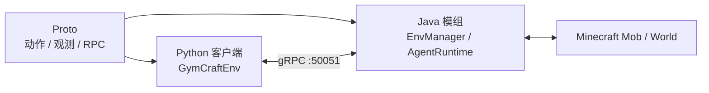

# GymCraft 开发文档

本文档收录根 README 中省略的实现细节，供环境、动作、观测和 Python 客户端开发使用。

## 运行架构

GymCraft 由共享 protobuf、Java 服务端模组和 Python 客户端组成：



`GymCraftRpcServer` 随服务端启动。`GymEnvService.Connect` 根据实体 UUID 查找
`EnvManager` 中已经存在的环境并建立独占会话，不负责创建环境。

一次 step 的主要流程如下：

1. Python 将动作组件打包为 `ProtoMcAction` 并通过 gRPC 提交。
2. `AgentRuntime` 将请求排队，等待受控实体的 tick。
3. entity tick 前执行动作并应用 Controller/环境级 AI 控制策略。
4. entity tick 后收集 `ProtoMcObservation`，计算奖励和终止状态。
5. gRPC 返回 Gymnasium 五元组所需的数据。

## 代码结构

```text
src/main/
├── java/io/github/mousemeya/gymcraft/
│   ├── gym/action/         动作调度器与组件 Controller
│   ├── gym/observation/    观测组合器与组件 Creator
│   ├── gym/env/            McEnv、环境实现与实体快照
│   ├── gym/runtime/        AgentRuntime tick 调度
│   ├── gym/rpc/            gRPC 服务与会话
│   ├── gym/menu/           逻辑菜单会话与菜单适配器（session/ 会话与槽位、bridge/ 物品栏桥接、adapter/ 按钮适配）
│   ├── gym/inventory/      Agent 统一物品栏布局
│   └── registry/           动作、观测、环境自定义注册表
├── proto/                  protobuf 与 GymEnvService 定义
└── python/                 uv 管理的 Python 客户端、demo 与调试脚本
```

核心类：

| 类 | 职责 |
|---|---|
| `EnvManager` | 按实体 UUID 管理环境生命周期 |
| `AbstractMcEnv` | 实现通用 reset/step、奖励与终止扩展点 |
| `AgentRuntime` | 在服务端 tick 中执行动作、维持策略并生成观测 |
| `ActionDispatcher` | 校验和分发 protobuf 动作组件 |
| `ObservationComposer` | 聚合环境启用的观测组件 |
| `EntitySnapshot` | reset 时重建相同 UUID 的受控 Mob |

## 注册表与组件

新增类型必须注册到相应入口：

- 动作：`ActionComponents`
- 观测：`ObservationCreators`
- 环境：`EnvFactories`

### 动作组件

| 注册 ID | 说明 |
|---|---|
| `gymcraft:step_move` | 单 tick 前进、横移、视角和跳跃控制 |
| `gymcraft:move_to` | 使用寻路移动到目标坐标 |
| `gymcraft:set_attack_target` | 设置实体攻击目标 |
| `gymcraft:attack_once` | 执行一次近战攻击 |
| `gymcraft:noop` | 空操作 |
| `gymcraft:jump` | 提交一次跳跃意图 |
| `gymcraft:break_block` | 通过 FakePlayer 复用原版方块破坏逻辑 |
| `gymcraft:set_block` | 校验手持物品、距离和实体碰撞后放置方块 |
| `gymcraft:open_menu` | 打开方块、实体或自身逻辑菜单 |
| `gymcraft:close_menu` | 关闭逻辑菜单会话 |
| `gymcraft:move_menu_item` | 在逻辑菜单槽位之间移动物品 |
| `gymcraft:click_menu_button` | 操作已适配菜单的按钮 |

### 观测组件

| 注册 ID | 说明 |
|---|---|
| `gymcraft:self` | 生命、位置、速度、姿态和目标等自身状态 |
| `gymcraft:world` | 时间、天气和维度 |
| `gymcraft:nearby_entities` | 一定范围内的实体 |
| `gymcraft:nearby_blocks` | 空气连通域中可见的方块表面 |
| `gymcraft:menu` | 当前逻辑菜单、槽位、属性和按钮 |

环境构造函数可以通过 `actionComponent(factory)` 和 `observationComponent(factory)`
获取当前环境专属组件实例，再覆盖观测半径、上限、移动速度或交互距离等默认参数。

## 环境与 AI 控制

当前环境包括：

- `gymcraft:simple_mob`：暴露通用动作和观测组件。
- `gymcraft:parkour_mob`：提供受限训练场、方块资源、上升奖励和 Q-learning demo。

`reset(options={"disable_vanilla_ai": true})` 会在 reset 后以及相邻动作之间的空闲期压制
Goal flags、寻路和关键 Brain memory，同时保留移动、重力与跳跃物理。动作开始时会释放
该环境级压制，执行期间仅由当前动作 Controller 按需控制原版行为；动作进入终态后恢复空闲期压制。

## gRPC 接口

服务定义位于 `src/main/proto/gymcraft/gym/rpc/env_service.proto`。

| RPC | 说明 |
|---|---|
| `Connect` | 连接已存在环境，返回会话 ID、metadata 和动作/观测空间 |
| `Reset` | 传入 seed/options，重建实体并返回初始观测 |
| `Step` | 提交动作，返回观测、奖励、terminated、truncated 和 info |
| `CloseSession` | 释放独占会话 |

动作和观测使用 protobuf；`options`、`metadata` 与 `info` 使用 JSON 字符串。
实体在 RUNNING 动作期间死亡时，当前 `Step` 会立即返回 `terminated=true` 和 `entity died`；
实体在动作间死亡时，则由下一次 `Step` 返回同一终态。两种情况都不会把正常 episode 终态
映射为 gRPC `FAILED_PRECONDITION`。
common config 中的 `rpcEnabled` 和 `rpcPort` 控制服务启用状态与端口。

## Python 客户端与 Demo

Python 包位于 `src/main/python/src/gymcraft`。`GymCraftEnv.reset()` 返回二元组，
`step()` 返回 Gymnasium 五元组；动作 dict 和解包后的观测均使用完整注册 ID 作为键。

```powershell
cd src\main\python
uv sync
uv run demos\parkour_q_learning_demo.py <entity_uuid> --episodes 200
```

`demos/parkour_q_learning_demo.py` 使用表格 Q-learning 训练 `parkour_mob`：

- 状态包含相对高度、落地状态、邻近方块、剩余资源和水平偏移。
- 动作包含跳跃、脚下放置、空操作和四向小步移动。
- reset 固定传入 `disable_vanilla_ai=True`。
- 参数可配置回合数、目标高度、方块数量、学习率、折扣率和探索率。

`src/main/python/debug` 下的脚本用于逐项验证动作和观测，不作为稳定公共 API。

## 菜单交互

逻辑菜单不要求真实客户端打开 Screen。统一 `slot_id` 包含装备槽、Mob 容器槽和菜单槽；
移动物品及点击按钮前必须基于最新 `gymcraft:menu` 观测进行 stale 校验。

详细设计见 [菜单交互实现方案](../menu-interaction-implementation-plan.md)。

## 构建与验证

```powershell
# Java 编译与构建
.\gradlew compileJava
.\gradlew build

# protobuf 变更后重新生成 Python 桩
.\gradlew generatePythonStubs

# Python 类型检查
cd src\main\python
uv run mypy src debug demos

# Python wheel/sdist
cd ..\..\..
.\gradlew packagePython

# 无客户端 GameTest
.\gradlew runGameTestServer
```

无头服务器测试需要设置 `pause-when-empty-seconds=-1`，并 forceload 受控 Mob 所在区块，
否则服务端可能暂停 tick，导致 gRPC step 长时间等待。

## 相关资料

- [菜单交互实现方案](../menu-interaction-implementation-plan.md)
- [村民 Brain 分析](../villager-brain-analysis.md)
- NeoForge 参考文档：`repo/Documentation`
- Minecraft 26.1 反编译源码：`repo/minecraft-source-1.26`

## 技术版本

- Minecraft 26.1
- NeoForge 26.1.2.95 (Minecraft 26.1.2)
- Java 25 / Gradle 9.2.1
- Python 3.11+ / uv / Gymnasium / grpcio
