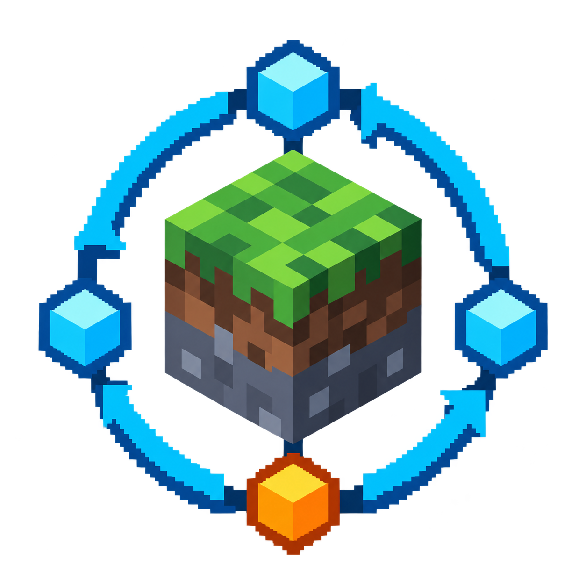

<p align="center">
  
</p>

# GymCraft 模组介绍 / Mod Introduction

## 中文

### 让 Minecraft 成为智能体的训练场

GymCraft 是一个面向强化学习、LLM Agent 和自动化实验的 NeoForge 模组。它可以把 Minecraft 中的 Mob 或自带的“模拟玩家”实体包装成 Gymnasium 风格环境，让外部 Python 程序通过 gRPC 观察世界、执行动作并获得奖励。

无论你想训练一个生物学习移动和跑酷、让语言模型完成采集与合成任务，还是搭建自己的 Minecraft 智能体基准，GymCraft 都提供了一套可扩展的基础设施。

> GymCraft 是智能体开发与研究工具，不是传统的生存内容扩展模组。使用它通常需要同时运行 Minecraft 模组和 Python Agent。

### 主要特色

- **Gymnasium 风格接口**：Python 客户端提供熟悉的 `reset()` 和 `step()` 工作流。
- **控制任意 Mob**：使用环境工具为现有 Mob 挂载训练环境，也可以使用具有玩家外观和属性的 `PlayerSimEntity`。
- **完整世界交互**：支持移动、寻路、注视、跳跃、战斗、挖掘、放置方块、使用物品、拾取和丢弃物品、聊天及菜单操作。
- **结构化观测**：可读取自身状态、世界信息、附近实体、方块、掉落物、菜单、感兴趣方块和聊天消息。
- **顺序动作批次**：一个 step 可以按顺序执行多项动作，并共享统一的超时控制。
- **LLM 友好**：内置紧凑观测文本、Minecraft 风格动作 DSL、上下文管理和 Chat Completions 兼容封装。
- **多人和专用服务器支持**：可通过游戏内工具、命令、RCON 和远程 gRPC 客户端控制环境。
- **中英文界面**：提供英文与简体中文物品、实体和操作提示。

### 内置环境

| 环境 | 说明 |
|---|---|
| `gymcraft:simple_mob` | 通用基础环境，适合测试动作、观测和自定义 Agent。 |
| `gymcraft:parkour_mob` | 跳跃并在脚下搭建方块，学习到达目标高度。 |
| `gymcraft:iron_mining` | 从空手开始采集木材、制作工具并取得粗铁。 |
| `gymcraft:iron_golem_warden` | 建造和治疗铁傀儡，完成对抗 Warden 的长程任务。 |
| `gymcraft:general` | 面向开放任务的综合环境，提供更完整的动作与世界观测。 |

### 快速开始

1. 安装与你的 Minecraft 版本匹配的 NeoForge 和 GymCraft 模组 JAR。
2. 启动世界或服务器。GymCraft 会同时启动 gRPC 服务，默认地址为 `localhost:50051`。
3. 在创造模式的 GymCraft 标签页取得 **环境工具** 和 **UUID 复制器**。
4. 按住 Shift 滚动滚轮选择环境类型，使用环境工具右键 Mob 创建环境。
5. 使用 UUID 复制器右键同一实体，取得连接所需的实体 UUID。
6. 安装 Python 客户端：

```bash
pip install -U gymcraft
```

运行一个 Q-learning 跑酷演示：

```bash
gymcraft-demo parkour <entity_uuid> --episodes 200
```

或者让兼容 Chat Completions 的语言模型控制智能体：

```bash
gymcraft-demo llm-chat <entity_uuid> --task "找到最近的箱子并查看里面的物品"
```

使用 `gymcraft-demo --help` 可以查看全部内置演示和参数。

### 兼容版本

| Minecraft | NeoForge | Java | GymCraft |
|---|---|---|---|
| 26.1.2 | 26.1.2.95 | 25 | 1.2.1 |
| 1.21.1 | 21.1.250 | 21 | 1.2.1+mc1.21.1 |

Python 客户端要求 Python 3.11 或更高版本。

### 适合谁

- 强化学习与模仿学习研究者
- Minecraft LLM Agent 开发者
- 需要可重复游戏任务的评测与教学项目
- 希望扩展自定义动作、观测或奖励函数的模组开发者

---

## English

### Turn Minecraft into an agent training ground

GymCraft is a NeoForge mod for reinforcement learning, LLM agents, and game automation experiments. It wraps Minecraft mobs—or its built-in simulated player entity—as Gymnasium-style environments, allowing external Python programs to observe the world, take actions, and receive rewards over gRPC.

Whether you want to train a mob to move and build upward, ask a language model to gather and craft resources, or create your own Minecraft agent benchmark, GymCraft provides an extensible foundation for the job.

> GymCraft is an agent development and research tool rather than a traditional content mod. A typical setup runs both the Minecraft mod and an external Python agent.

### Highlights

- **Gymnasium-style API:** The Python client exposes the familiar `reset()` and `step()` workflow.
- **Control almost any mob:** Attach an environment to an existing mob, or use `PlayerSimEntity`, a player-shaped controllable entity with player-like attributes.
- **Rich world interaction:** Move, navigate, look, jump, fight, mine, place blocks, use items, pick up and drop items, chat, and operate menus.
- **Structured observations:** Read self state, world data, nearby entities, blocks, dropped items, menus, tracked blocks, and chat messages.
- **Ordered action batches:** Execute multiple actions sequentially within one step under a shared timeout.
- **LLM-ready tooling:** Includes compact observation text, a Minecraft-like action DSL, conversation context management, and a Chat Completions compatible wrapper.
- **Multiplayer and dedicated-server friendly:** Manage environments with in-game tools, commands, RCON, or remote gRPC clients.
- **English and Simplified Chinese UI:** Item names, entity names, and common operation messages are localized.

### Built-in environments

| Environment | Description |
|---|---|
| `gymcraft:simple_mob` | A general-purpose base environment for testing actions, observations, and custom agents. |
| `gymcraft:parkour_mob` | Learn to jump and place blocks underneath the agent to reach a target height. |
| `gymcraft:iron_mining` | Start empty-handed, gather wood, craft tools, and obtain raw iron. |
| `gymcraft:iron_golem_warden` | Build and heal an iron golem to complete a long-horizon Warden encounter. |
| `gymcraft:general` | A broad open-task environment with a comprehensive action and observation set. |

### Quick start

1. Install NeoForge and the GymCraft mod JAR matching your Minecraft version.
2. Start a world or server. GymCraft starts its gRPC service at `localhost:50051` by default.
3. Take the **Environment Tool** and **UUID Copier** from the GymCraft creative tab.
4. Hold Shift and scroll to choose an environment, then right-click a mob with the Environment Tool.
5. Right-click the same entity with the UUID Copier to obtain its UUID.
6. Install the Python client:

```bash
pip install -U gymcraft
```

Run the Q-learning parkour demo:

```bash
gymcraft-demo parkour <entity_uuid> --episodes 200
```

Or connect any Chat Completions compatible model:

```bash
gymcraft-demo llm-chat <entity_uuid> --task "Find the nearest chest and inspect its contents"
```

Run `gymcraft-demo --help` to list all bundled demos and options.

### Compatibility

| Minecraft | NeoForge | Java | GymCraft |
|---|---|---|---|
| 26.1.2 | 26.1.2.95 | 25 | 1.2.1 |
| 1.21.1 | 21.1.250 | 21 | 1.2.1+mc1.21.1 |

The Python client requires Python 3.11 or newer.

### Who is it for?

- Reinforcement-learning and imitation-learning researchers
- Developers building LLM agents for Minecraft
- Evaluation and education projects that need repeatable game tasks
- Mod developers extending custom actions, observations, environments, or reward functions

## Links

- GitHub Releases: <https://github.com/slk3hdio/gymcraft/releases>
- Python package: <https://pypi.org/project/gymcraft/>
- Development documentation: [docs/dev/README.md](dev/README.md)
